---
output:
  xaringan::moon_reader:
    seal: false
    css: [default,rutgers,metropolis-fonts,custom.css]
    lib_dir: libs
    nature:
      highlightStyle: googlecode
      highlightLines: true
      highlightSpans: true
      countIncrementalSlides: false
      ratio: '16:9'
    
---


```{r setup, include=FALSE}
require(knitr)
require(kableExtra)
require(tidyverse)
options(kableExtra.latex.load_packages = FALSE)
options(knitr.table.format = "html")
```

class: inverse, center, middle
background-image: url(imgs/cc.svg),url(imgs/cbi.png),url(imgs/logo_UT3_RVB.png),url(imgs/index.jpeg)
background-position: 100% 0%,25% 100%,50% 100%,75% 100%
background-size: 28%,15%,20%,10%

## .center[Deep Learning with .large[__R__] and __`keras`__]

### .center[R user group]
<hr />

.large[Vincent ROCHER | Chromatin and DNA Repair | 26/03/2020]


---

.pull-left[
.large[
### Table of content
- What is Deep learning
- Tensorflow & Keras
- Keras with R
- Some examples
  - text classification
  - image classification
]

]

.pull-right[


]


---
## What is __Deep Learning__ ?

.pull-left[


]

.pull-right[
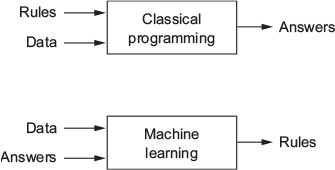


]

- __AI: __ Hard-coded rules.
- __Machine Learning: __ Learn from data using features.
- __Deep Learning: __ Learn representations from data.

---
## History
.pull-left[

#### Core of deep learning: 
- __Artificial neuron__ (_1943_)
- __Perceptron__ (_1957_)

#### The network: 
- __Multilayer perceptron__ (_1967_)

#### More complex networks: 
- __Vision__:
  - __Neocognitron__ (_1980_)
  - __Convolution__ (_1998_)
  
- __Speech__:
  - __Recurrent neural networks__ (_1986_)
  - __Long short-term memory__ (_1997_)

]

--

.pull-right[

### Image generation with GANs

```{r out.width = '70%',echo=F}

```

[thispersondoesnotexist.com](https://thispersondoesnotexist.com/)

]
---
## Deep Learning applications
### A Neural Network for Machine Translation, at Production Scale 

.center[
```{r out.width = '60%',echo=F}
knitr::include_graphics("imgs/google_translate.png")
```

_from Google AI blog_
]

---
## Deep Learning applications
### Computer Vision

.center[
```{r out.width = '70%',echo=F}

```

_from Google AI blog_
]

---
## Deep Learning applications
### Neural style transfer

.center[
```{r out.width = '35%',echo=F}
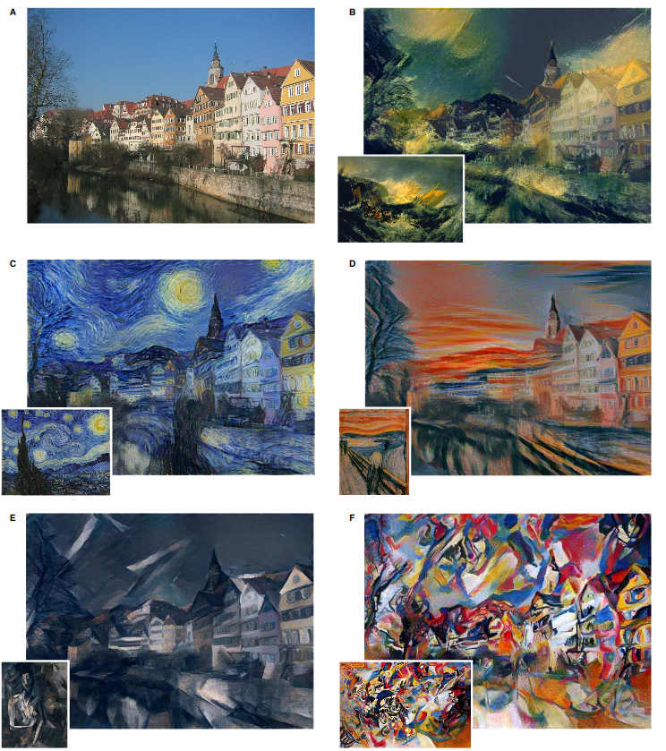
```

_from Image Style Transfer Using Convolutional Neural Networks_
]

---


## What is __Deep Learning__ ?
.pull-left[

#### A _deep_ neural network

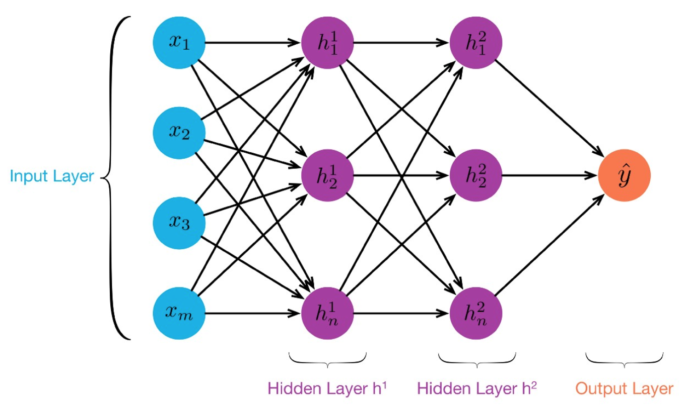

]

.pull-right[
#### An artificial neuron
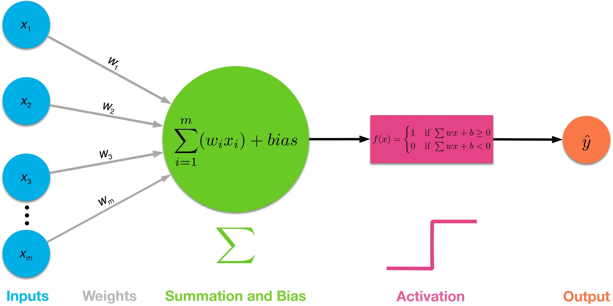

]

.large[
- A layer apply a __geometric transformation__ on a tensor and output a __tensor__ using _weights_ (also __tensors__).
- A _deep_ neural network consist of successive (linear) __stack of layers__, from an _input layer_ to a single _output layer_.
]


---


## What is __Deep Learning__ ?

.pull-left[
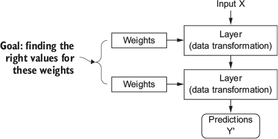
__Weights__ progressively transform $X$ into $Y'$.
]
--
.pull-right[
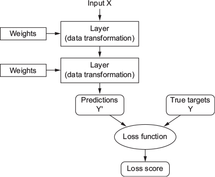
- __Loss score__ represent the __distance__ between $Y'$ and $Y$.
]

---
## What is __Deep Learning__ ?

.pull-left[

__Weights__ progressively transform $X$ into $Y'$.
]

.pull-right[
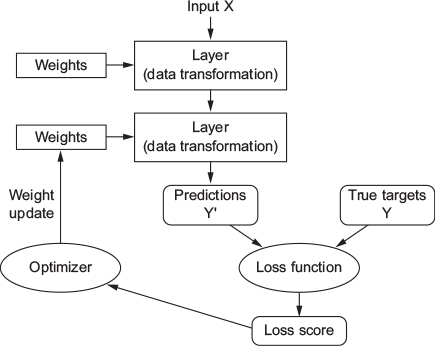

- __Loss score__ represent the __distance__ between $Y'$ and $Y$.
- __Optimizer__ update the __weights__  with _backpropagation_ and _stochastic gradient descent_.

]

---
## __Loss__ & __Activation__ functions

.large[
```{r,echo=F}
tibble(
  "Problem type" = c(
    "Regression",
    "Binary classification",
    "Multiclass classification"
  ),
  "Activation" = c(
    "None (linear)",
    "Sigmoid",
    "Softmax"
  ),
  "Loss" = c(
    "Mean Square Error (MSE) or Mean Absolute Error (MSE)",
    "Binary crossentropy",
    "Categorical crossentropy"
  )
) %>% kable(caption = "Activation and Loss for different problems",booktabs = T) %>%kable_styling(bootstrap_options = c("striped", "hover")) %>% 
  column_spec(1, bold = T, background = "#2980b9",color="white") %>%
  column_spec(2, bold = T,color = "black" ,width = "20em") %>% 
  column_spec(3, bold = T,color = "black" ,width = "40em")
```
]

---

##Library for deep learning

.pull-left[

### Tensorflow

```{r out.width = '50%',echo=F}
knitr::include_graphics("imgs/FullColorPrimary Icon.svg")
```

- Open source platform for machine learning (and deep learning) developed by Google.
- _Tensor_: Manipulate data as __tensors__.
- _flow_: Build computation node as __graph__.

]

.pull-right[
### Keras 

```{r out.width = '40%',echo=F}

```

- High level neural network API (`python`).
- Work with __Tensorflow__, __CNTK__, or __Theano__.
- __User-friendly__ & work very well with __Tensorflow__.

]

---

## R interface to Keras

#### Package `keras` by Rstudio (https://keras.rstudio.com/).

--

```{r eval=FALSE}
install.packages("keras")
# default installation
library(keras)
install_keras()

# install using a conda environment (default is virtualenv)
install_keras(method = "conda")

# install with GPU version of TensorFlow
# (NOTE: only do this if you have an NVIDIA GPU + CUDA!)
install_keras(tensorflow = "gpu") #<<

# install a specific version of TensorFlow
install_keras(tensorflow = "1.2.1")
install_keras(tensorflow = "1.2.1-gpu")
```

---

## R interface to Keras

### Change backend

.pull-left[

```{r,eval=F}
library(keras)
use_backend("theano")
```

__Theano__ is an open-source symbolic tensor manipulation framework developed by LISA Lab at Université de Montréal.


]

.pull-right[

```{r,eval=F}
library(keras)
use_backend("cntk")
```

__CNTK__ is an open-source toolkit for deep learning developed by Microsoft.

]


---

## Input data as tensors

### What are tensors ?

```{r,echo=F}
tibble(
  "Dimension" = str_c(0:4,"D"),
  "R object" = c(
    "42",
    "c(42, 42, 42)",
    "matrix(42, nrow = 2, ncol = 2)",
    "array(42, dim = c(2,3,2))",
    "array(42, dim = c(2,3,2,3))"
  ),
  "Data" = c(
    "",
    "Vector data",
    "Timeseries data",
    "Images",
    "Videos"
  ),
  "Description" = 
    c(
      "",
      "2D tensors of shape (samples, features)",
      "3D tensors of shape (samples, timesteps, features)",
      "Images 	4D tensors of shape (samples, height, width, channels)",
      "Video 	5D tensors of shape (samples, frames, height, width, channels)"
    )
) %>% kable(caption = "Examples of tensors",booktabs = T) %>%kable_styling(bootstrap_options = c("striped", "hover")) %>% 
  column_spec(1, bold = T, background = "#2980b9",color="white") %>%
  column_spec(2, bold = T,color = "black" ,width = "40em") %>% 
  column_spec(4,width = "20em")
```

__Tensors__ are a _generalization_ of vectors and matrices to an __arbitrary number of dimensions__ (or _axis_).


---

## Build a model in R


.pull-left[
### Sequential mode (basic)
```{r, message=FALSE, warning=FALSE}
library(keras)

model <- keras_model_sequential() 
model %>% 
  layer_dense(32, input_shape=c(784)) %>% 
  layer_activation('relu') %>% 
  layer_dense(10) %>% 
  layer_activation('softmax')
```


]


.pull-right[
### With Keras functional API
```{r, message=FALSE, warning=FALSE}
input <- layer_input(shape = c(784))

output <- input %>% 
  layer_dense(32) %>% 
  layer_activation('relu') %>% 
  layer_dense(10) %>% 
  layer_activation('softmax')
  
model <- keras_model(input,output)
```
]

---

## Build a model in R


.pull-left[
### Sequential mode (basic)
```{r, eval=F}
library(keras)

model <- keras_model_sequential() 
model %>% 
  layer_dense(32, `input_shape=c(784)`) %>% #<<
  layer_activation('relu') %>% 
  `layer_dense(10)` %>% 
  layer_activation('softmax')
```


]


.pull-right[
### With Keras functional API
```{r, eval=F}
library(keras)

input <- `layer_input(shape = c(784))`

output <- input %>% 
  layer_dense(32) %>% #<<
  layer_activation('relu') %>% 
  layer_dense(10) %>% 
  `layer_activation('softmax')`
  
model <- keras_model(input,output)
```
]


---

## R to Tensorflow graph


.pull-left[

<!-- # ```{r out.width = '60%',echo=F} -->
<!-- # 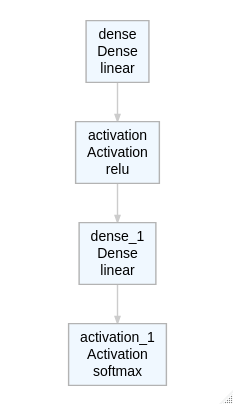 -->
<!-- # ``` -->
```{r out.width = '60%',echo=F}
library(keras)

input <- layer_input(shape = c(784),name = "my_input_layer")

output <- input %>% 
  layer_dense(32,name = "my_first_dense_layer") %>% #<<
  layer_activation('relu',name = "my_first_activation_layer") %>% 
  layer_dense(10,name = "my_output_dense_layer") %>% 
  layer_activation('softmax',name = "my_output_activation_layer")
  
model <- keras_model(input,output)

model %>% deepviz::plot_model()

```

]


.pull-right[
### R
```{r, message=FALSE, warning=FALSE}
library(keras)

model <- keras_model_sequential() 
model %>% 
  layer_dense(32, input_shape=c(784)) %>% 
  layer_activation('relu') %>% 
  layer_dense(10) %>% 
  layer_activation('softmax')
```

]

---

### Summary of our model

```{r, highlight.output = c(13)}
summary(model)
```

---

### A very big model

```{r message=FALSE, warning=FALSE, r,echo=F}
vgg16_imagenet_model <- application_vgg16(include_top = TRUE, weights = NULL,
  input_tensor = NULL, input_shape = NULL, pooling = NULL)
```

```{r,eval=F}
summary(vgg16_imagenet_model)
```
```
Model: "vgg16"
_________________________________________________________________________________________________________________________
Layer (type)                                          Output Shape                                    Param #            
=========================================================================================================================
input_1 (InputLayer)                                  [(None, 224, 224, 3)]                           0                  
_________________________________________________________________________________________________________________________
block1_conv1 (Conv2D)                                 (None, 224, 224, 64)                            1792               
_________________________________________________________________________________________________________________________
block1_conv2 (Conv2D)                                 (None, 224, 224, 64)                            36928              
_________________________________________________________________________________________________________________________
block1_pool (MaxPooling2D)                            (None, 112, 112, 64)                            0                  
_________________________________________________________________________________________________________________________
...
_________________________________________________________________________________________________________________________
flatten (Flatten)                                     (None, 25088)                                   0                  
_________________________________________________________________________________________________________________________
fc1 (Dense)                                           (None, 4096)                                    102764544          
_________________________________________________________________________________________________________________________
fc2 (Dense)                                           (None, 4096)                                    16781312           
_________________________________________________________________________________________________________________________
predictions (Dense)                                   (None, 1000)                                    4097000            
=========================================================================================================================
*Total params: 138,357,544
Trainable params: 138,357,544
Non-trainable params: 0
_________________________________________________________________________________________________________________________
```
---
### Compilation

```r
model %>% compile(
  optimizer = "rmsprop",
  loss = "categorical_crossentropy",
  metrics = c("acc")
)
```

`compile()` modify the model object in place (no return).

- `optimizer`: This object specifies the training procedure. Commonly used optimizers are e.g.
adam, rmsprop, or sgd.
- `loss`: The function to minimize during optimization. Common choices include mean square error (mse), categorical_crossentropy, and binary_crossentropy.
- `metrics`: Used to monitor training. In classification, this usually is accuracy.

---

### Training


```r
history <- model %>% fit(
  x_train, y_train,
  epochs = 10,
  batch_size = 128,
  validation_split = 0.2,
  verbose = 1
)
```

- `epochs = 10`: Use 10 times our dataset to train the model.
- `batch_size = 128`: Model feed by mini-batches of 128 samples.
- `validation_split = 0.2`: Keep 20% of our train data for validation.

---

### Training

```r
plot(history)
```
.center[

```{r out.width = '80%',echo=F}
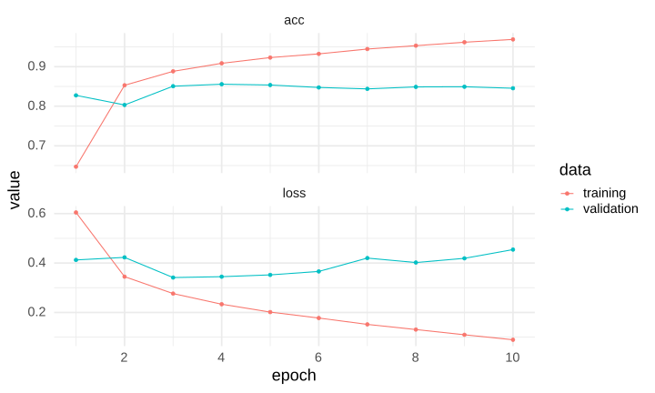
```

]

---
### Evaluation and prediction

```r
model %>% evaluate(x_test,y_test)
```

```
$loss
[1] 0.4052937

$acc
[1] 0.8454
```

```r
model %>% predict_classes(x_test[1:10,])
```

```
 [1] 0 1 1 0 1 1 1 0 1 1
```

```r
 model %>% predict_proba(x_test[1:10,])
```
```
 [1] 8.842140e-03 9.998803e-01 9.527058e-01 4.542440e-01 9.996748e-01 8.639503e-01 9.832536e-01
 [8] 7.519126e-05 9.976131e-01 9.998198e-01
```

---

### Use __Hyperparameter Tuning__

#### Define flags for key parameters ...
```{r,eval=F}
FLAGS <- flags(
  flag_string("activation","relu"),
  flag_string("activation2","softmax"),
  flag_string("optimizer",'rmsprop'),
  flag_string("loss",'binary_crossentropy'),
  flag_numeric("epoch",10),
  flag_numeric("dense1",128),
  flag_numeric("dense2",16)
  
)
```

---
### Use __Hyperparameter Tuning__
#### ... And replace hard-coded hyperparameters by `FLAGS$hyper_parameter_name`:

```{r,eval=F}

model_tuning <- keras_model_sequential() %>% 
  layer_dense(`FLAGS$dense1`, input_shape=c(784)) %>% 
  layer_activation(`FLAGS$activation`) %>% 
  layer_dense(`FLAGS$dense2`) %>% 
  layer_activation(`FLAGS$activation2`)

model_tuning %>% compile(
  optimizer = `FLAGS$optimizer`,
  loss = `FLAGS$loss`,
  metrics = c("acc")
)

history <- model %>% fit(
  x_train, y_train,
  epochs = `FLAGS$loss`,
  batch_size = 128,
  validation_split = 0.2
)

```

---
### Use __Hyperparameter Tuning__

### Prepare our model for __Hyperparameter Tuning__

#### Then launch hypertuning

```{r,eval=F}
require("tfruns")
tuning_run("model_tuning.R", runs_dir = "hypertuning/model_tuning", flags = list(
  dense1 = c(512,256,128),
  dense2 = c(64,32,16)
))
```

```bash
Rscript model_tuning.R --epoch 5 --dense1 128 --dense2 64
```


---

## Python vs R 


#### First examples found on the documentation ([R](https://keras.rstudio.com/articles/sequential_model.html), [python](https://keras.io/getting-started/sequential-model-guide/))

.pull-left[


### `python`
```{python,eval=F}
from keras.models import Sequential
from keras.layers import Dense, Activation

model = Sequential([
    Dense(32, input_shape=(784,)),
    Activation('relu'),
    Dense(10),
    Activation('softmax'),
])

```
]


.pull-right[
### `R`
```{r, message=FALSE, warning=FALSE}
library(keras)

model <- keras_model_sequential() 
model %>% 
  layer_dense(32, input_shape=c(784)) %>% 
  layer_activation('relu') %>% 
  layer_dense(10) %>% 
  layer_activation('softmax')

```
]


---
## Layers available

### Dense layer

```r
dense_layer()
```


.center[

```{r out.width = '60%',echo=F}

```

]

---
### Convolution layer

####Convolution in 1D

```r
layer_conv_1d()
```


.center[
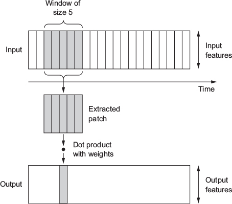
]
---
### Convolution layer
####Convolution in 2D

```r
layer_conv_2d()
```

.center[
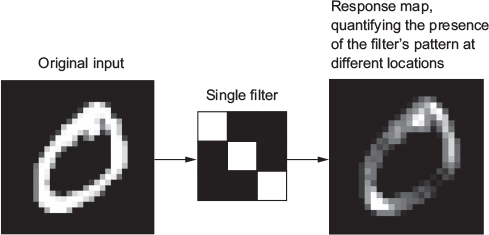
]
---
### Recurrent neural network (RNN)


```r
layer_simple_rnn()
layer_lstm()
layer_gru()
```


.center[

_from http://colah.github.io/posts/2015-08-Understanding-LSTMs/_

]
---

### Embedding layer

```r
layer_embedding()
```

.center[
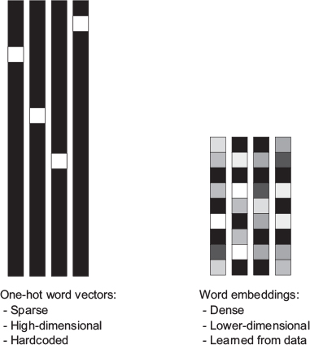
]

---
### Regularization layer

#### L1 / L2 regularization
```r
regularizer_l1(l = 0.01)

regularizer_l2(l = 0.01)

regularizer_l1_l2(l1 = 0.01, l2 = 0.01)
```

.pull-left[

#### Dropout

```r
layer_dropout(0.5)
```
]
.pull-right[
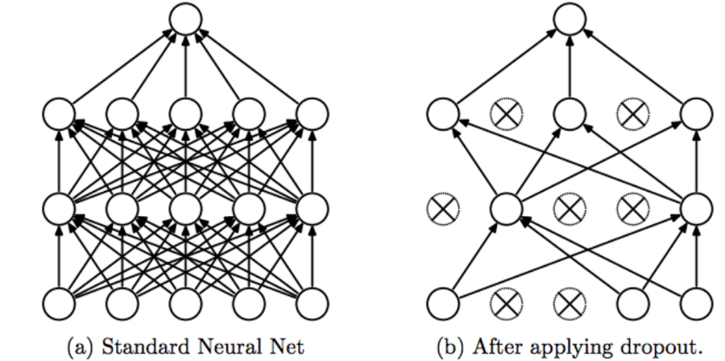
_Srivastava, Nitish, et al. ”Dropout: a simple way to prevent neural networks from overfitting”, JMLR 2014_
]

---
### Regularization layer

#### Gaussian noise

```r
layer_gaussian_noise()
layer_gaussian_dropout()
```

- __GaussianNoise__: Add zero-centered noise, with specified standard deviation (Similar to data augmentation).
- __GaussianDropout__: A combination of Dropout and Gaussian noise.


#### Batch normalization
```r
layer_batch_normalization()
```

- __Batch normalization__: Scaling/centering batches to avoid the layers to adapt themselves to a new distribution in every training step.

---
### And many others
.center[
```{r,echo=F}
knitr::include_url('https://keras.rstudio.com/reference/index.html')
```

]

---

## __Application:__ Predict DNA secondary structure using DNA sequences

###.large[Deep__G4:__] A deep learning approach to predict active G-quadruplexes

__Input:__ `ACTGTGGGGATTTCTTAGGCTTTAGGGGACTTATGTGCTAGGGG`

__Output:__
.center[

```{r out.width = '45%',echo=F}
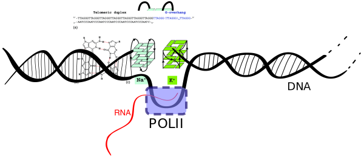
```

]

---
class: split-80

### Mapping G4s in vivo with __BG4-seq__ (2018)


.column[

* ChIP-seq for the DNA secondary structures through the use of a G4-structure-specific single-chain antibody (BG4).
* Refinements in chromatin immunoprecipitation.
* Followed by high-throughput sequencing.

```{r out.width = '100%',echo=F}
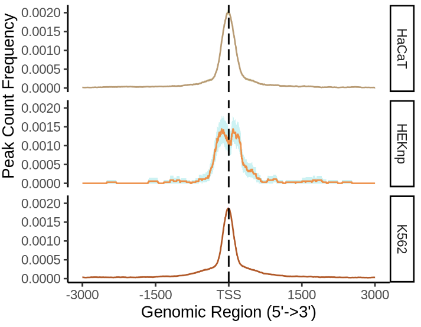
```
]
.column[

[Genome-wide mapping of endogenous G-quadruplex DNA structures by chromatin immunoprecipitation and high-throughput sequencing](https://www.nature.com/articles/nprot.2017.150)


```{r out.width = '70%',echo=F}
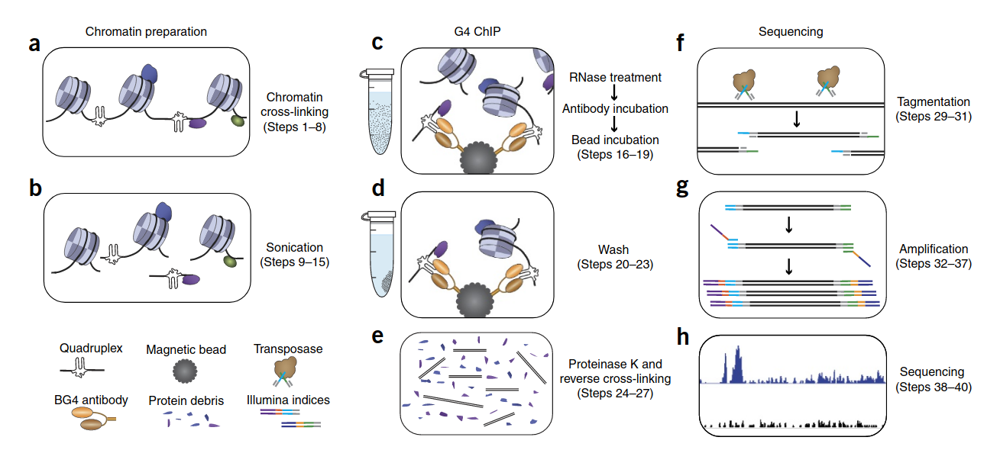
```


]

---
## __DeepG4__ model architecture

```{r out.width = '100%',echo=F}
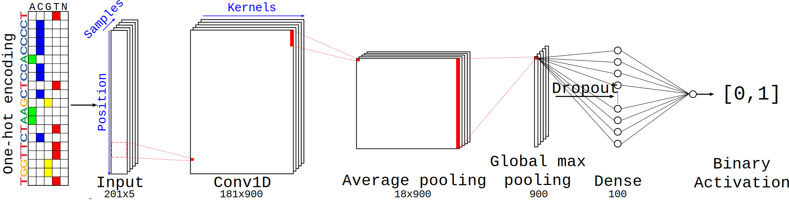
```

1. __Conv1D__: Scan sequences using kernel (20bp).
2. __Average pooling__: Reduce dimension size and aggregate kernel signal.
3. __Global max pooling__: Output max activation signal for each kernel.
4. __Dropout__: Regularization layer.
5. __Dense layer__ `(100 units,linear)`: Combination of weighted kernel signal.
6. __Dense layer__ `(1 unit, sigmoid)`: Output a probability.


---
## __DeepG4__ model architecture ... in __R__

```{r,eval=F}
input <- layer_input(shape = input_shape)
output <- input %>% 
    layer_conv_1d(filters = FLAGS$filters1, kernel_size = FLAGS$kernel_size1, activation = FLAGS$activation) %>%
    layer_average_pooling_1d(pool_size = FLAGS$pool_size1) %>% 
    layer_global_max_pooling_1d() %>%
    layer_dropout(FLAGS$dropout1) %>% 
    layer_dense(FLAGS$dense_1) %>% 
    layer_dense(1) %>%
    layer_activation("sigmoid")
  
model <- keras_model(input,output)

model %>% compile(
    optimizer = optimizer_rmsprop(lr = FLAGS$learning_rate),
    loss = FLAGS$loss,
    metrics = c('accuracy')
)

history <- model %>% fit(
  x_train,y_train,
  epochs = FLAGS$epoch,
  batch_size = 128,
  validation_split = 0.2,
  verbose=1,
  callbacks = list(
    callback_model_checkpoint("best_model.h5",save_best_only=TRUE)
  )
)
```


---
## Input data

```{r,warning=F,message=F}
library(Biostrings)
library(DeepG4)

sequences <- system.file("extdata", "test_G4_data.fa", package = "DeepG4")
sequences <- readDNAStringSet(sequences)
sequences <- sequences %>% DNAToNumerical()
sequences %>% dim()
```

```{r out.width = '100%',echo=F}
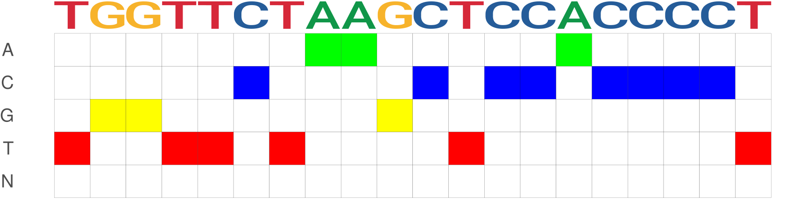
```

---

## Output

```{r,echo=F,warning=F,message=F}
model <- system.file("extdata", "model.hdf5", package = "DeepG4") %>% load_model_hdf5()
```

```{r}
model %>% predict(sequences) %>% head()
```

---

### Convolution weights are motifs


```{r,warning=F,message=F,eval=F}
require(ggseqlogo)
require(cowplot)
res <- sequences %>% 
  ExtractMotifFromModel(top_kernel=4)
p.pcm <- lapply(res,function(x){ggseqlogo(as.matrix(x)) + ggplot2::theme_classic(base_size=14)})
print(plot_grid(plotlist = p.pcm,ncol=2))
```

.center[
```{r,warning=F,message=F,fig.height= 3,fig.width=18,dev='svg',echo=F}
require(ggseqlogo)
require(cowplot)
res <- system.file("extdata", "test_G4_data.fa", package = "DeepG4") %>% 
  readDNAStringSet %>% 
  ExtractMotifFromModel(top_kernel=4)
p.pcm <- lapply(res,function(x){ggseqlogo(as.matrix(x)) + ggplot2::theme_classic(base_size=14)})
print(plot_grid(plotlist = p.pcm,ncol=4))
```
]
