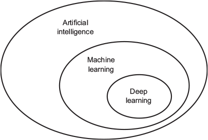
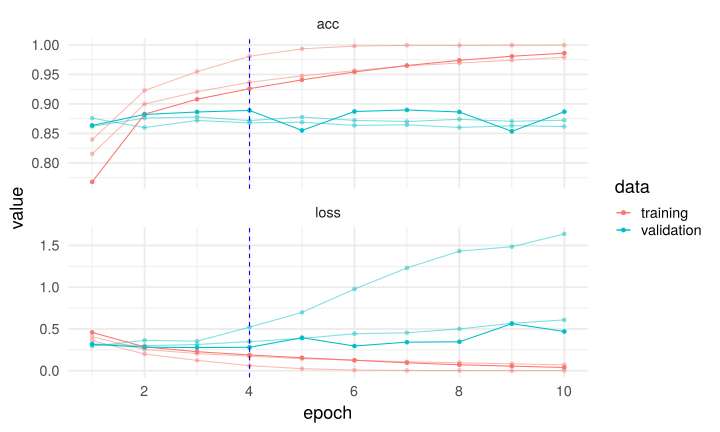

---
output:
  xaringan::moon_reader:
    seal: false
    css: [default,rutgers,metropolis-fonts,custom.css]
    lib_dir: libs
    nature:
      highlightStyle: googlecode
      highlightLines: true
      highlightSpans: true
      countIncrementalSlides: false
      ratio: '16:9'
    
---


```{r setup, include=FALSE}
require(knitr)
require(kableExtra)
require(tidyverse)
options(kableExtra.latex.load_packages = FALSE)
options(knitr.table.format = "html")
```

class: inverse, center, middle
background-image: url(imgs/cc.svg),url(imgs/cbi.png),url(imgs/logo_UT3_RVB.png),url(imgs/index.jpeg)
background-position: 100% 0%,25% 100%,50% 100%,75% 100%
background-size: 28%,15%,20%,10%

## .center[Deep Learning with .large[__R__] and __`keras`__]

### .center[Journal Club Bioinfo]
<hr />

.large[Vincent ROCHER | Chromatin and DNA Repair | 27/02/2020]


---

.pull-left[
.large[
### Table of content
- What is Deep learning
- Tensorflow & Keras
- Keras with R
- Some examples
  - text classification
  - image classification
]

]

.pull-right[


]


---
## What is __Deep Learning__ ?

.pull-left[


]

.pull-right[


]

- __AI: __ Hard-coded rules.
- __Machine Learning: __ Learn from data using features.
- __Deep Learning: __ Learn representations from data.


---
## History
.pull-left[

#### Core of deep learning: 
- __Artificial neuron__ (_1943_)
- __Perceptron__ (_1957_)

#### The network: 
- __Multilayer perceptron__ (_1967_)

#### More complex networks: 
- __Vision__:
  - __Neocognitron__ (_1980_)
  - __Convolution__ (_1998_)
  
- __Speech__:
  - __Recurrent neural networks__ (_1986_)
  - __Long short-term memory__ (_1997_)

]

--

.pull-right[
### Wow 

### Such dream
]
---
## Deep Learning applications
### A Neural Network for Machine Translation, at Production Scale 

.center[
```{r out.width = '60%',echo=F}
knitr::include_graphics("imgs/google_translate.png")
```

_from Google AI blog_
]

---
## Deep Learning applications
### Computer Vision

.center[
```{r out.width = '70%',echo=F}

```

_from Google AI blog_
]

---
## Deep Learning applications
### Neural style transfer

.center[
```{r out.width = '35%',echo=F}

```

_from Image Style Transfer Using Convolutional Neural Networks_
]
---
## Deep Learning applications
### Enhancing Hi-C data resolution

.center[


```{r out.width = '50%',echo=F}

```

```{r out.width = '40%',echo=F}

```

_from Zhang et al., Nature comm., 2018_
]
---
## Deep Learning applications
### Predicting the DNA-binding proteins by deep learning

```{r out.width = '40%',echo=F}

```
_from Alipanahi et al., Nature biotech., 2015_

```{r out.width = '70%',echo=F}

```


---
## Deep Learning applications
.pull-left[

```{r out.width = '100%',echo=F}

```
_from https://github.com/lykaust15/Deep_learning_examples_


]


.pull-right[

- __ImageNet challenge__: In 2012, from 73% accuracy to 84%. Now >95%.
- __Computer vision__.
- __Natural language processing__.

### Deep Learning in bioinformatics
- __Sequence analysis__ from _Next Generation Sequencing_ data.
- __Regression analysis__ with _gene expression_.
- __Graph embedding__ for _protein-protein interactions_.

You can find some examples [here](https://github.com/lykaust15/Deep_learning_examples).
]
---

## What is __Deep Learning__ ?

.center[


```{r out.width = '100%',echo=F}
# 
knitr::include_graphics("imgs/diffprog.jpg")
```

]

### Or ...

.pull-left[
> Layered representations learning

]

.pull-right[
> Chained geometric transformation learning

]


---

## What is __Deep Learning__ ?
.pull-left[

#### A _deep_ neural network


]

.pull-right[
#### An artificial neuron


]

.large[
- A layer apply a __geometric transformation__ on a tensor and output a __tensor__ using _weights_ (also __tensors__).
- A _deep_ neural network consist of successive (linear) __stack of layers__, from an _input layer_ to a single _output layer_.
]


---


## What is __Deep Learning__ ?

.pull-left[

__Weights__ progressively transform $X$ into $Y'$.
]
--
.pull-right[

- __Loss score__ represent the __distance__ between $Y'$ and $Y$.
]

---
## What is __Deep Learning__ ?

.pull-left[

__Weights__ progressively transform $X$ into $Y'$.
]

.pull-right[


- __Loss score__ represent the __distance__ between $Y'$ and $Y$.
- __Optimizer__ update the __weights__  with _backpropagation_ and _stochastic gradient descent_.

]

---
## What is __Deep Learning__ ?
.large[
In short, deep learning is to minimize $C(y_i,y^{'}_i)$

... where $y^{'}_i=f^{L}(W^{L}f^{L-1}(W^{L-1}...f^{1}(W^{1}x_i)))$
]

---
## __Loss__ & __Activation__ functions

.large[
```{r,echo=F}
tibble(
  "Problem type" = c(
    "Regression",
    "Binary classification",
    "Multiclass classification"
  ),
  "Activation" = c(
    "None (linear)",
    "Sigmoid",
    "Softmax"
  ),
  "Loss" = c(
    "Mean Square Error (MSE) or Mean Absolute Error (MSE)",
    "Binary crossentropy",
    "Categorical crossentropy"
  )
) %>% kable(caption = "Activation and Loss for different problems",booktabs = T) %>%kable_styling(bootstrap_options = c("striped", "hover")) %>% 
  column_spec(1, bold = T, background = "#2980b9",color="white") %>%
  column_spec(2, bold = T,color = "black" ,width = "20em") %>% 
  column_spec(3, bold = T,color = "black" ,width = "40em")
```
]

---

## Tensors

### What are tensors ?

```{r,echo=F}
tibble(
  "Dimension" = str_c(0:4,"D"),
  "R object" = c(
    "42",
    "c(42, 42, 42)",
    "matrix(42, nrow = 2, ncol = 2)",
    "array(42, dim = c(2,3,2))",
    "array(42, dim = c(2,3,2,3))"
  ),
  "Data" = c(
    "",
    "Vector data",
    "Timeseries data",
    "Images",
    "Videos"
  ),
  "Description" = 
    c(
      "",
      "2D tensors of shape (samples, features)",
      "3D tensors of shape (samples, timesteps, features)",
      "Images 	4D tensors of shape (samples, height, width, channels)",
      "Video 	5D tensors of shape (samples, frames, height, width, channels)"
    )
) %>% kable(caption = "Examples of tensors",booktabs = T) %>%kable_styling(bootstrap_options = c("striped", "hover")) %>% 
  column_spec(1, bold = T, background = "#2980b9",color="white") %>%
  column_spec(2, bold = T,color = "black" ,width = "40em") %>% 
  column_spec(4,width = "20em")
```

__Tensors__ are a _generalization_ of vectors and matrices to an __arbitrary number of dimensions__ (or _axis_).
---

##Library for deep learning

.pull-left[

### Tensorflow

```{r out.width = '50%',echo=F}
knitr::include_graphics("imgs/FullColorPrimary Icon.svg")
```

- Open source platform for machine learning (and deep learning) developed by Google.
- _Tensor_: Manipulate data as __tensors__.
- _flow_: Build computation node as __graph__.

]

.pull-right[
### Keras 

```{r out.width = '40%',echo=F}
knitr::include_graphics("imgs/Keras_Logo.jpg")
```

- High level neural network API (`python`).
- Work with __Tensorflow__, __CNTK__, or __Theano__.
- __User-friendly__ & work very well with __Tensorflow__.

]

---

## R interface to Keras

#### Package `keras` by Rstudio (https://keras.rstudio.com/).

--

```{r eval=FALSE}
install.packages("keras")
# default installation
library(keras)
install_keras()

# install using a conda environment (default is virtualenv)
install_keras(method = "conda")

# install with GPU version of TensorFlow
# (NOTE: only do this if you have an NVIDIA GPU + CUDA!)
install_keras(tensorflow = "gpu") #<<

# install a specific version of TensorFlow
install_keras(tensorflow = "1.2.1")
install_keras(tensorflow = "1.2.1-gpu")
```

---

## R interface to Keras

### Change backend

.pull-left[

```{r,eval=F}
library(keras)
use_backend("theano")
```

__Theano__ is an open-source symbolic tensor manipulation framework developed by LISA Lab at Université de Montréal.


]

.pull-right[

```{r,eval=F}
library(keras)
use_backend("cntk")
```

__CNTK__ is an open-source toolkit for deep learning developed by Microsoft.

]

---

## Python vs R 


#### First examples found on the documentation ([R](https://keras.rstudio.com/articles/sequential_model.html), [python](https://keras.io/getting-started/sequential-model-guide/))

.pull-left[


### `python`
```{python,eval=F}
from keras.models import Sequential
from keras.layers import Dense, Activation

model = Sequential([
    Dense(32, input_shape=(784,)),
    Activation('relu'),
    Dense(10),
    Activation('softmax'),
])

```
]


.pull-right[
### `R`
```{r, message=FALSE, warning=FALSE}
library(keras)

model <- keras_model_sequential() 
model %>% 
  layer_dense(32, input_shape=c(784)) %>% 
  layer_activation('relu') %>% 
  layer_dense(10) %>% 
  layer_activation('softmax')

```
]

---

## R to Tensorflow graph


.pull-left[

```{r out.width = '60%',echo=F}

```


]


.pull-right[
### `R`
```{r, message=FALSE, warning=FALSE}
library(keras)

model <- keras_model_sequential() 
model %>% 
  layer_dense(32, input_shape=c(784)) %>% 
  layer_activation('relu') %>% 
  layer_dense(10) %>% 
  layer_activation('softmax')

```
]

---

### Summary of our model

```{r, highlight.output = c(13)}
summary(model)
```

---

### A very big model

```{r message=FALSE, warning=FALSE, r,echo=F}
vgg16_imagenet_model <- application_vgg16(include_top = TRUE, weights = NULL,
  input_tensor = NULL, input_shape = NULL, pooling = NULL)
```

```{r,eval=F}
summary(vgg16_imagenet_model)
```
```
Model: "vgg16"
_________________________________________________________________________________________________________________________
Layer (type)                                          Output Shape                                    Param #            
=========================================================================================================================
input_1 (InputLayer)                                  [(None, 224, 224, 3)]                           0                  
_________________________________________________________________________________________________________________________
block1_conv1 (Conv2D)                                 (None, 224, 224, 64)                            1792               
_________________________________________________________________________________________________________________________
block1_conv2 (Conv2D)                                 (None, 224, 224, 64)                            36928              
_________________________________________________________________________________________________________________________
block1_pool (MaxPooling2D)                            (None, 112, 112, 64)                            0                  
_________________________________________________________________________________________________________________________
...
_________________________________________________________________________________________________________________________
flatten (Flatten)                                     (None, 25088)                                   0                  
_________________________________________________________________________________________________________________________
fc1 (Dense)                                           (None, 4096)                                    102764544          
_________________________________________________________________________________________________________________________
fc2 (Dense)                                           (None, 4096)                                    16781312           
_________________________________________________________________________________________________________________________
predictions (Dense)                                   (None, 1000)                                    4097000            
=========================================================================================================================
*Total params: 138,357,544
Trainable params: 138,357,544
Non-trainable params: 0
_________________________________________________________________________________________________________________________
```
---
### Compilation

```r
model %>% compile(
  optimizer = "rmsprop",
  loss = "categorical_crossentropy",
  metrics = c("acc")
)
```

`compile()` modify the model object in place (no return).
--

### Training


```r
history <- model %>% fit(
  x_train, y_train,
  epochs = 10,
  batch_size = 128,
  validation_split = 0.2,
  verbose = 1
)
```

- `epochs = 10`: Use 10 times our dataset to train the model.
- `batch_size = 128`: Model feed by mini-batches of 128 samples.
- `validation_split = 0.2`: Keep 20% of our train data for validation.

---

### Training

```r
plot(history)
```
.center[

```{r out.width = '80%',echo=F}
knitr::include_graphics("imgs/example_plot_history.svg")
```

]

---
### Evaluation and prediction

```r
model %>% evaluate(x_test,y_test)
```

```
$loss
[1] 0.4052937

$acc
[1] 0.8454
```

```r
model %>% predict_classes(x_test[1:10,])
```

```
 [1] 0 1 1 0 1 1 1 0 1 1
```

```r
 model %>% predict_proba(x_test[1:10,])
```
```
 [1] 8.842140e-03 9.998803e-01 9.527058e-01 4.542440e-01 9.996748e-01 8.639503e-01 9.832536e-01
 [8] 7.519126e-05 9.976131e-01 9.998198e-01
```

---
## Layers available

### Dense layer

```r
dense_layer()
```


.center[

```{r out.width = '60%',echo=F}
knitr::include_graphics("imgs/layer_exemple.png")
```

]

---
### Convolution layer

####Convolution in 1D

```r
layer_conv_1d()
```


.center[

]
---
### Convolution layer
####Convolution in 2D

```r
layer_conv_2d()
```

.center[

]
---
### Recurrent neural network (RNN)


```r
layer_simple_rnn()
layer_lstm()
layer_gru()
```


.center[

_from http://colah.github.io/posts/2015-08-Understanding-LSTMs/_

]
---

### Embedding layer

```r
layer_embedding()
```

.center[

]

---
### Regularization layer

#### L1 / L2 regularization
```r
regularizer_l1(l = 0.01)

regularizer_l2(l = 0.01)

regularizer_l1_l2(l1 = 0.01, l2 = 0.01)
```

.pull-left[

#### Dropout

```r
layer_dropout(0.5)
```
]
.pull-right[

_Srivastava, Nitish, et al. ”Dropout: a simple way to prevent neural networks from overfitting”, JMLR 2014_
]

---
### Regularization layer

#### Gaussian noise

```r
layer_gaussian_noise()
layer_gaussian_dropout()
```

- __GaussianNoise__: Add zero-centered noise, with specified standard deviation (Similar to data augmentation).
- __GaussianDropout__: A combination of Dropout and Gaussian noise.


#### Batch normalization
```r
layer_batch_normalization()
```

- __Batch normalization__: Scaling/centering batches to avoid the layers to adapt themselves to a new distribution in every training step.

---
### And many others
.center[
```{r,echo=F}
knitr::include_url('https://keras.rstudio.com/reference/index.html')
```

]

---
## __Example 1__: IMDB Movie reviews

#### Predict sentiment (_positive_/_negative_) with _25000_ movies reviews.

```{r,eval=F}
?dataset_imdb
```


> Dataset of 25,000 movies reviews from IMDB, labeled by sentiment (positive/negative). Reviews have been preprocessed, and each review is encoded as a sequence of word indexes (integers). For convenience, words are indexed by overall frequency in the dataset, so that for instance the integer "3" encodes the 3rd most frequent word in the data. This allows for quick filtering operations such as: "only consider the top 10,000 most common words, but eliminate the top 20 most common words".

---

## __Example 1__: IMDB Movie reviews

```{r}
max_features <- 10000                                    
imdb <- dataset_imdb(num_words = max_features)
c(c(x_train, y_train), c(x_test, y_test)) %<-% imdb     
maxlen <- x_train %>% map(length) %>% unlist() %>% median()   
x_train <- pad_sequences(x_train, maxlen = maxlen)
x_train %>% dim()
x_test <- pad_sequences(x_test, maxlen = maxlen)
x_test %>% dim()
```

---
## __Example 1__: IMDB Movie reviews

```{r,echo=F}
TranslateToWord <- function(index){
  word <- if(index >=3) reverse_word_index[[as.character(index - 3)]]
  if(!is.null(word)) word else "?"
}
```


```{r}
word_index <- dataset_imdb_word_index()
reverse_word_index <- names(word_index) %>% setNames(word_index)
```

###Positive review

```{r}
one_positive_review <- x_train[y_train == 1,][1,]
one_positive_review
```

---
## __Example 1__: IMDB Movie reviews
###Positive review

```{r,eval = F}
one_positive_review %>% map(TranslateToWord) %>% paste(collapse = " ")
```

> `r one_positive_review %>% map(TranslateToWord) %>% paste(collapse = " ")`

---
## __Example 1__: IMDB Movie reviews
###negative review

```{r}
one_negative_review <- x_train[y_train == 0,][1,]
```
```{r,eval=F}
one_negative_review %>% map(TranslateToWord) %>% paste(collapse = " ")

```

> `r one_negative_review %>% map(TranslateToWord) %>% paste(collapse = " ")`


---

## __Example 1__: IMDB Movie reviews
###__First__ method: count presence / absence of words

```{r,eval=F}
#Set an array of dim (nrow,max_features)
#Set 1 if a word is present
CountMatrix <- function(x_data,max_features = 10000){
  x_occ_data <- array(0L,dim = c(nrow(x_data),max_features))
  for(i in 1:nrow(x_data)){
    x <- table(x_data[i,])
    x <- x[names(x) != "0"]
    x_occ_data[i,as.integer(names(x))] <- 1
  }
  return(x_occ_data)
}

```

#### Transform data

```{r,eval=F}
x_occ_train <- x_train %>% CountMatrix
x_occ_test <- x_test %>% CountMatrix
```

---
## __Example 1__: IMDB Movie reviews
###__First__ method: count presence / absence of words

### Build model 

```{r,eval=F}
model <- keras_model_sequential() %>%
  layer_dense(128,input_shape = c(max_features), activation = "relu") %>% 
  layer_dense(units = 64, activation = "relu") %>% 
  layer_dense(units = 1, activation = "sigmoid")
```

### Compile

```{r,eval=F}

model %>% compile(
  optimizer = "rmsprop",
  loss = "binary_crossentropy",
  metrics = c("acc")
)
```
---
## __Example 1__: IMDB Movie reviews
###__First__ method: count presence / absence of words

#### History

```{r,eval=F}
history <- model %>% fit(
  x_occ_train, y_train,
  epochs = 10,
  batch_size = 128,
  validation_split = 0.2,
  verbose = 0
)

```
---

#### Plot history

```{r,eval=F}
plot(history)
```

.center[
```{r out.width = '80%',echo=F}

```
]

---

## __Example 1__: IMDB Movie reviews
### Prepare our model for __Hyperparameter Tuning__

#### Define flags for key parameters ...
```{r,eval=F}
FLAGS <- flags(
  flag_string("activation","relu"),
  flag_string("optimizer",'rmsprop'),
  flag_string("loss",'binary_crossentropy'),
  flag_numeric("epoch",10),
  flag_numeric("dense1",128),
  flag_numeric("dense2",16),
  flag_numeric("dropout1",0.6),
  flag_numeric("dropout2",0.2)
  
)
```

---
## __Example 1__: IMDB Movie reviews
#### ... And replace hard-coded hyperparameters by `FLAGS$hyper_parameter_name`:

```{r,eval=F}
model_tuning <- keras_model_sequential() %>%
  layer_dense(`FLAGS$dense1`,input_shape = c(max_features), activation = `FLAGS$activation`) %>% 
  layer_dropout(`FLAGS$dropout1`) %>%
  layer_dense(units = `FLAGS$dense2`, activation = `FLAGS$activation`) %>% 
  layer_dropout(`FLAGS$dropout2`) %>%
  layer_dense(units = 1, activation = "sigmoid")

model_tuning %>% compile(
  optimizer = `FLAGS$optimizer`,
  loss = `FLAGS$loss`,
  metrics = c("acc")
)
```

---
## __Example 1__: IMDB Movie reviews
### Prepare our model for __Hyperparameter Tuning__

#### Then launch hypertuning

```{r,eval=F}
require("tfruns")
tuning_run("imdb_occ_dense.R", runs_dir = "hypertuning/imdb_occ_dense", flags = list(
  dense1 = c(512,256,128),
  dense2 = c(64,32,16),
  dropout1 = c(0,0.2,0.4,0.6),
  dropout2 = c(0,0.2,0.4,0.6)
))
```

```bash
Rscript imdb_occ_dense.R --epoch 5 --dense1 128 --dense2 64 --dropout1 0.6 --dropout2 0.2
```


---

## __Example 1__: IMDB Movie reviews


#### History with tuning


```{r,eval=F}
history_tuning <- model %>% fit(
  x_occ_train, y_train,
  epochs = `FLAGS$epoch`,
  batch_size = 128,
  validation_split = 0.2,
  verbose = 0
)
```

---

#### Plot history

```{r,eval=F}
plot(history_tuning)
```

.center[
```{r out.width = '80%',echo=F}

```
]

---
## __Example 1__: IMDB Movie reviews
###__Second__ method: Use __one-hot__ encoding 

- __Pros__: Most basic way to turn a token into a vector. 

 - Encode integer indexes into binary vectors of size `max_features` : $\mathbf{T} = \mathbf{[}0,0,0,...,1,0\mathbf{]}$ where $1$ is positionned at the word index.
 - Remove __ranking__ between words.
 
--

- __Cons__: _High dimensionality_ : 

  - at sample level : Encode $\mathbf{T}: 25000 \times 174 \rightarrow 25000 \times 10000$ (equivalent to count presence / absence of words).
  - at the character level $\mathbf{T}: 25000 \times 174 \rightarrow 25000 \times 174 \times 10000$. A binary encoding of size `max_features` for each position 

---

###__Second__ method: Use __one-hot__ encoding 

```{r}
sequences <- c("A","C","T","T","G","T","G","C")
sequences
tokenizer <- text_tokenizer() %>%
  fit_text_tokenizer(sequences)


one_hot_results <- texts_to_matrix(tokenizer, sequences, mode = "binary")

```
.center[
```{r fig.height=3, fig.width=10, dev='svg', echo=F}
one_hot_results <- one_hot_results[,2:ncol(one_hot_results)]
rownames(one_hot_results) <- as.character(1:8)
colnames(one_hot_results) <- c("T","C","G","A")

one_hot_results %>% as.data.frame() %>% tibble::rownames_to_column() %>% gather(-rowname,key = pos,value = value) %>%
  mutate(pos = factor(pos,levels= c("A","C","G","T"))) %>% ggplot(aes(x=rowname,y=pos,fill=as.character(value))) + geom_tile(colour = "black") + theme_minimal(base_size = 18) + ylab("One hot")+ xlab("Position") + scale_fill_manual(values = c("black","white")) + theme(legend.position ="none") 
```
]

---

### __Third__ method: Using word __embedding__
```{r embe-label, eval=FALSE}
model_embedding <- keras_model_sequential() %>%
  layer_embedding(input_dim = max_features, output_dim = 64,     #<<
                input_length = maxlen) %>% #<<
  layer_flatten() %>% 
  layer_dropout(0.6) %>% 
  layer_dense(units = 128, activation = "relu") %>% 
  layer_dropout(0.2) %>% 
  layer_dense(units = 1, activation = "sigmoid")
summary(model_embedding)
```

---

### __Third__ method: Using word __embedding__

```{r embe-label-out, ref.label="embe-label", echo=FALSE,highlight.output = c(5,17)}
```

---
### How to kept text semantic ?

#### Using word embedding

- __Problem__: Use `layer_embedding` keeps the semantics but `layer_flatten` + `layer_dense` lose it ! 

--

- __Solution__ for sequence processing: use _convolution layers_ or _reccurent layers_ :
  
  - _Convolution layers_ extract local patches (sub-sequences).
  - _Reccurent layers_ kept short/long dependencies when processing timeseries or sequence data.


---

### Using word __embedding__ _AND_ __convolution layer__


```{r conv-label, eval=FALSE}
conv_model <- keras_model_sequential() %>%
  layer_embedding(input_dim = max_features, output_dim = 50,    #<<  
                  input_length = maxlen) %>% #<<
  layer_dropout(0.2) %>% 
  layer_conv_1d(filters = 250,kernel_size = 3, activation = "relu") %>%  #<<
  layer_global_max_pooling_1d() %>% 
  layer_dense(250, activation = "relu") %>% 
  layer_dropout(0.2) %>% 
  layer_dense(units = 1, activation = "sigmoid")
summary(conv_model)
```

---

### Using word __embedding__ _AND_ __convolution layer__

```{r conv-label-out, ref.label="conv-label", echo=FALSE,highlight.output = c(5,19)}
```

---

### Using word __embedding__ _AND_ __convolution layer__

```{r,eval=F}

conv_model %>% compile(
  optimizer = "rmsprop",
  loss = "binary_crossentropy",
  metrics = c("acc")
)

history_conv <- conv_model %>% fit(
  x_train, y_train,
  epochs = 10,
  batch_size = 32,
  validation_split = 0.2
)
```

---
#### Plot history

```{r,eval=F}
plot(history_conv)
```

.center[
```{r out.width = '80%',echo=F}

```
]

---

#### Evaluate for 4 epochs

```{r,eval = F}
conv_model %>% evaluate(x_test,y_test)
```

```
$loss
[1] 0.3101077

$acc
[1] 0.87648
```

Best model so far, but could be combined with RNN/LSTM networks
.center[
.pull-left[
#### Convolution layer
```{r out.width = '60%',echo=F}
knitr::include_graphics("imgs/06fig22.jpg")
```

]
.pull-right[
#### Simple RNN layer

]
]
---
### __Bonus__: Visualize embedding layer

```{r, message=FALSE, warning=FALSE,echo=F}
embedding_matrix <- readRDS("/home/rochevin/Documents/PROJET_THESE/deeplearning_keras/conv_embd_layer_weights.rds")
tsne <- readRDS("/home/rochevin/Documents/PROJET_THESE/deeplearning_keras/conv_embd_layer_weights_tsne.rds")
words <- tibble(
  word = reverse_word_index, 
  id = as.integer(names(reverse_word_index))
) %>% 
  filter(id <= nrow(embedding_matrix)) %>%
  arrange(id)
```

#### Get the weights of the embedding layer
```{r,eval=F}
embedding_matrix <- get_weights(conv_model)[[1]] #<<
embedding_matrix %>% dim()
words <- tibble(
  word = reverse_word_index, 
  id = as.integer(names(reverse_word_index))
) %>% 
  filter(id <= nrow(embedding_matrix)) %>%
  arrange(id)

row.names(embedding_matrix) <-  words$word
```


```{r,message=F,warning=F}
require(text2vec) # Load for sim2 function
# Given a vector of size output_dim return the index of n nearest vectors (cosine) 
find_similar_words <- function(word, embedding_matrix, n = 10000) {
  similarities <- embedding_matrix[word, , drop = FALSE] %>%
    sim2(embedding_matrix, y = ., method = "cosine") #<<
  similarities[,1] %>% sort(decreasing = TRUE) %>% head(n)
}
```
---
### __Bonus__: Visualize embedding layer

```{r}
find_similar_words("good", embedding_matrix)["bad"]
```

.pull-left[

```{r,echo=F,results='asis'}
find_similar_words("good", embedding_matrix)[-1] %>%
  enframe() %>%
  mutate(Groups = ntile(value,1000)) %>% filter(Groups %in% c(1,1000)) %>%
  group_by(Groups) %>%
  slice(1:5) %>%
  ungroup() %>% dplyr::select(-Groups) %>% 
  mutate(value = cell_spec(round(value,3), "html",color = "white",bold = T, background = ifelse(value > 0, "#27ae60", "#e74c3c")))%>% 
kable(caption = "Top 5 most/less similar words for good",booktabs = T,escape = F) %>% 
  column_spec(1,width = "20em")

```
]
.pull-right[
```{r,echo=F,results='asis'}
find_similar_words("bad", embedding_matrix)[-1] %>%
  enframe() %>%
  mutate(Groups = ntile(value,1000)) %>% filter(Groups %in% c(1,1000)) %>%
  group_by(Groups) %>%
  slice(1:5) %>%
  ungroup() %>% dplyr::select(-Groups) %>% 
  mutate(value = cell_spec(round(value,3), "html",color = "white",bold = T, background = ifelse(value > 0, "#27ae60", "#e74c3c")))%>% 
kable(caption = "Top 5 most/less similar words for bad",booktabs = T,escape = F) %>% 
  column_spec(1,width = "20em")

```
]

---
class: center

```{r,eval=F,echo=F}
library(Rtsne)
tsne <- Rtsne(embedding_matrix, perplexity = 50, pca = FALSE)
```

#### 2D representation of word embedding using t-SNE

```{r echo=FALSE, fig.height=8, fig.width=16, message=FALSE, warning=FALSE,dev="svg"}
library(ggplot2)
library(plotly)
library(widgetframe)
good.sim <- find_similar_words("good", embedding_matrix, n = 400)
bad.sim <- find_similar_words("bad", embedding_matrix, n = 400)
ids_bad_good <- words %>% filter(word %in% c(names(bad.sim),names(good.sim))) %>% pull(word)
tsne_plot <- tsne$Y %>%
  as.data.frame() %>%
  mutate(word = words$word) %>%
  filter(word %in% ids_bad_good) %>% 
  mutate(Group = case_when(word %in% names(good.sim) ~ "good",TRUE ~ "bad")) %>% 
  ggplot(aes(x = V1, y = V2, label = word,col = Group)) + 
  theme_minimal() +
  geom_text(size = 3) + theme(legend.position = "bottom") + ylab("") + xlab("") 
tsne_plot
```

---

#### 2D representation using other embedding

.center[
```{r out.width = '35%',echo=F}

```

]
[tf2-preview/gnews-swivel-20dim](https://tfhub.dev/google/tf2-preview/gnews-swivel-20dim/1): 
- Token based text embedding trained on English Google News 130GB corpus.
- Vocabulary contains 20,000 tokens and 1 out of vocabulary bucket for unknown tokens.
```{r,warning=F,message=F,echo=F}
tf_embedding_matrix <- readRDS("gnews-swivel-20dim_embedding.rds")
```


```{r}
find_similar_words("good", tf_embedding_matrix)["bad"]
```
---
class: center

#### 2D representation using [transfert learning](https://tfhub.dev/google/tf2-preview/gnews-swivel-20dim/1)

```{r echo=FALSE, fig.height=6, fig.width=12, message=FALSE, warning=FALSE,dev="svg"}
# tf_tsne <- Rtsne(tf_embedding_matrix, perplexity = 50, pca = FALSE)
tf_tsne <- readRDS("/home/rochevin/Documents/PROJET_THESE/deeplearning_keras/gnews-swivel-20dim_tsne.rds")
tf_tsne_plot <- tf_tsne$Y %>%
  as.data.frame() %>%
  mutate(word = rownames(tf_embedding_matrix)) %>%
  filter(word %in% ids_bad_good) %>% 
  mutate(Group = case_when(word %in% names(good.sim) ~ "good",TRUE ~ "bad")) %>% 
  ggplot(aes(x = V1, y = V2, label = word,col = Group)) + 
  theme_minimal() +
  geom_text(size = 3) + theme(legend.position = "bottom") + ylab("") + xlab("") 
tf_tsne_plot
```


---
## __Example 2__: MNIST database of handwritten digits

#### Translate images of numbers (60000) into numbers `c(1,2,3,4,5,6,7,8,9)`

```{r,echo=F}
mnist <- dataset_mnist()
c(c(train_images, train_labels), c(test_images, test_labels)) %<-% mnist
```

```{r,eval=F}
?dataset_mnist
```


> Dataset of 60,000 28x28 grayscale images of the 10 digits, along with a test set of 10,000 images. 

.center[
```{r echo=F, fig.height=4, fig.width=8, message=FALSE, warning=FALSE, dev='png'}
preprocess_images <- . %>% as_tibble() %>% 
                rownames_to_column(var = 'y') %>% 
                gather(x, val, V1:V28) %>%
                mutate(x = str_replace(x, 'V', '')) %>% 
                mutate(x = as.numeric(x),
                       y = as.numeric(y)) %>% 
                mutate(y = 28-y)
 

sample.images <- sample(1:60000,10)
digit <- train_images[sample.images,,]

digit_melted <- array_branch(digit,1) %>% set_names(str_c("image_",1:10)) %>% map(preprocess_images) %>% bind_rows(.id = "Images")

digit_melted %>% ggplot(aes(x,y,fill = val)) + geom_tile() + theme_void() + facet_wrap(~Images,ncol = 5) + scale_fill_viridis_c(option = "inferno") + theme(legend.position = "none", strip.background = element_blank(),
  strip.text.x = element_blank(),panel.spacing=unit(-0.6, "lines"))
```
]
---

## __Example 2__: MNIST database of handwritten digits

### Preprocess data

#### Translate images of numbers (60000) into numbers `c(1,2,3,4,5,6,7,8,9)`

```{r}
mnist <- dataset_mnist()
c(c(train_images, train_labels), c(test_images, test_labels)) %<-% mnist
dim(train_images)
```


---
## __Example 2__: MNIST database of handwritten digits

### Preprocess data

- Redefine  dimension of train/test inputs: 

```{r,eval=F}
train_images <- array_reshape(train_images, c(nrow(train_images), 28, 28, 1))
test_images <- array_reshape(test_images, c(nrow(test_images), 28, 28, 1))
input_shape <- c(28, 28, 1)
```
... To fit to a 2D convolution layer.

- Normalize images between [0,1]: 
```{r,eval=F}
train_images <- train_images / 255
test_images <- test_images / 255
```

... Because models love to deal with small numbers.

---
### Preprocess data

- And convert class vectors to binary class matrices: 
```{r}
train_labels <- to_categorical(train_labels, 10)
test_labels <- to_categorical(test_labels, 10)
train_labels[1:10,]
```

---

### Build model 

```{r,eval=F}
model_mnist <- keras_model_sequential() %>%
  layer_conv_2d(filters = 64, kernel_size = c(3,3), activation = 'relu') %>% 
  layer_max_pooling_2d(pool_size = c(2, 2)) %>% 
  layer_conv_2d(filters = 32, kernel_size = c(3,3), activation = 'relu',
                input_shape = input_shape) %>% 
  layer_global_max_pooling_2d() %>% 
  layer_dense(units = 128, activation = 'relu') %>% 
  layer_dropout(rate = 0.5) %>% 
  layer_dense(units = 10, activation = 'softmax')
model_mnist %>% compile(
  loss = loss_categorical_crossentropy,
  optimizer = "rmsprop",
  metrics = c('accuracy')
)
```

### Compile

```{r,eval=F}
model_mnist %>% compile(
  loss = loss_categorical_crossentropy,
  optimizer = "rmsprop",
  metrics = c('accuracy')
)
```
---
## __Example 2__: MNIST database of handwritten digits
### Using a 2D convolution layer

#### History

```{r,eval=F}
history_mnist <- model_mnist %>% fit(
  train_images, train_labels,
  batch_size = 128,
  epochs = 12,
  validation_split = 0.2
)
```
---

#### Plot history

```{r,eval=F}
plot(history_mnist)
```

.center[
```{r out.width = '80%',echo=F}

```
]

---
#### Evaluate the model

```{r,eval =F}
model_mnist %>% evaluate(
  test_images, test_labels, verbose = 0
)
```
```
$loss
[1] 0.08596531

$acc
[1] 0.9724
```

Could even go to `0.99` with small modifications / hypertuning

---
class: inverse, center, middle
background-image: url(imgs/cc.svg),url(imgs/cbi.png),url(imgs/logo_UT3_RVB.png),url(imgs/index.jpeg)
background-position: 100% 0%,25% 100%,50% 100%,75% 100%
background-size: 28%,15%,20%,10%

## .right[__Thanks for your attention !__]

<hr />

.large[Vincent ROCHER | Chromatin and DNA Repair | 27/02/2020]
---

class: split-40

.column[
###Loss function

- __Regression__:
  - Mean Square Error (MSE) $MSE = \frac{\displaystyle\sum_{i=1}^{n} (y_i - y^p_i )^2}{n}$
  - Mean Absolute Error (MSE) $MSE = \frac{\displaystyle\sum_{i=1}^{n} \lvert y_i - y^p_i \lvert}{n}$

- __Multiclass classification__ :
  - Categorical crossentropy:

- __Binary classification__:
  - _binary crossentropy_: $H(p,q) = - \sum p(x)\,log\,q(x)$


]
.column[
###Activation

- __Binary classification__:
  - _sigmoid activation_: $f(x) = \frac{1}{1 + e^{-x}}$

- __Multiclass classification__:
  - _softmax activation_: $\sigma(x) = \frac{e^{a_i}}{\sum_{K} e^{a_k}}$

- __Regression__:
  - _linear activation_: $f(x)=x$

]